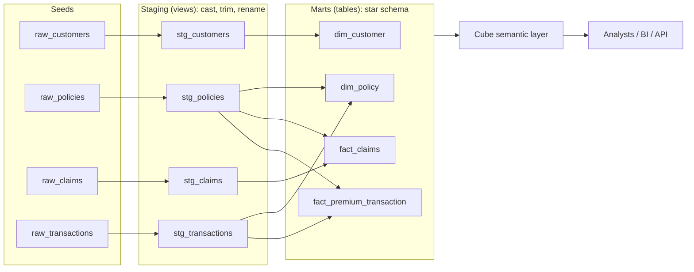
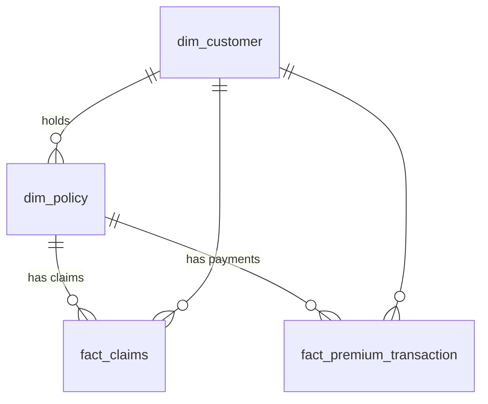
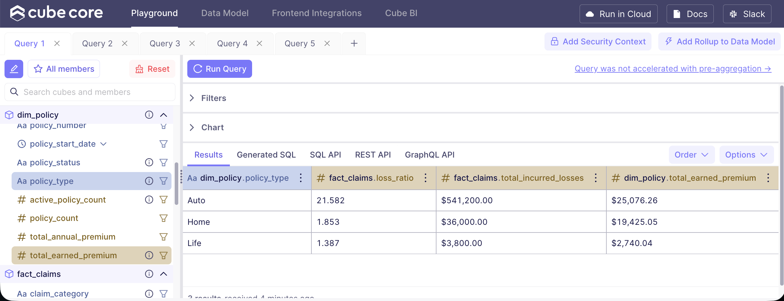
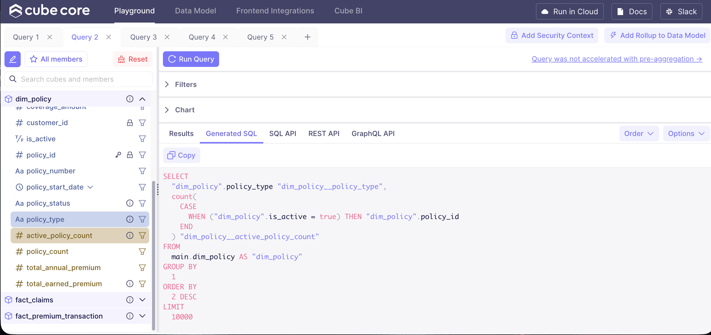
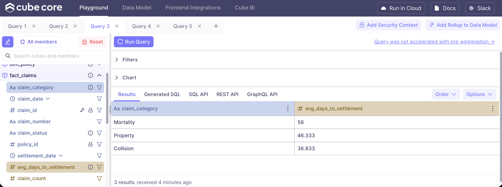
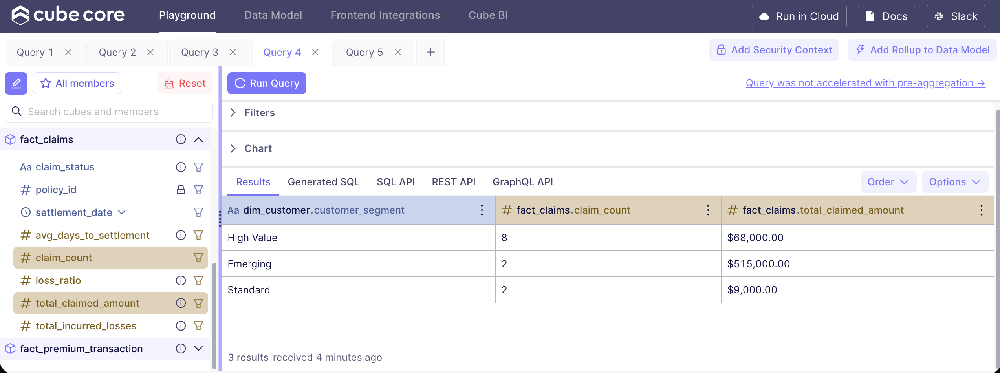
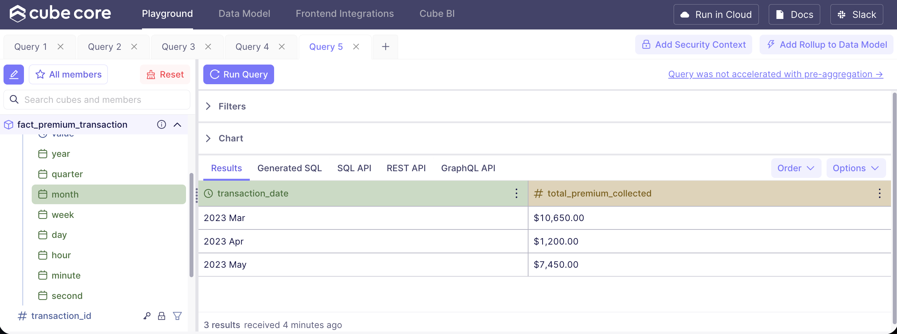
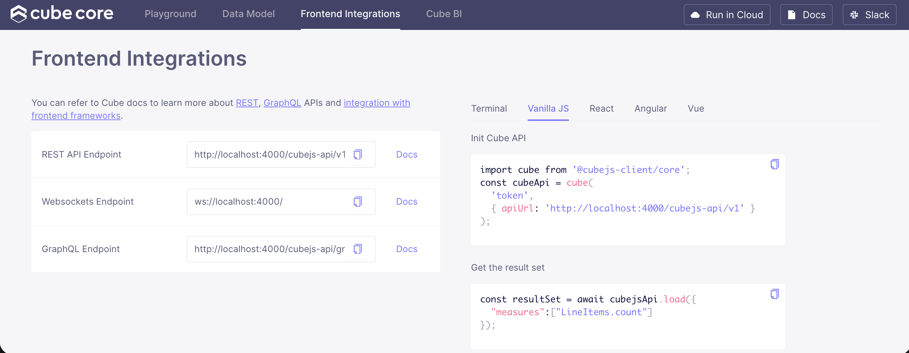

# Insurance Semantic Layer (dbt + DuckDB + Cube)

A self-service semantic layer over fake insurance data. Analysts can answer underwriting and claims questions without writing SQL:

- What is our loss ratio by policy type?
- How many active policies do we have?
- What is the average time to claim settlement?

**Stack:** dbt-duckdb (staging → marts), DuckDB (warehouse), Cube (semantic layer and API).

## Contents

- [0. Quick start](#quick-start)
- [1. Data profile](#1-data-profile)
- [2. Data gaps](#2-data-gaps)
- [3. Assumptions](#3-assumptions)
- [4. Flowchart](#4-flowchart)
- [5. Data contract](#5-data-contract)
- [6. Data quality tests](#6-data-quality-tests)
- [7. Sample queries](#7-sample-queries)
- [8. Frontend integrations](#8-frontend-integrations)

## Quick start

```bash
git clone https://github.com/jeeeet25/insurance-semantic-layer.git
cd insurance-semantic-layer
python3 -m venv .venv
source .venv/bin/activate
pip install -r requirements.txt
dbt build
docker compose -f cube/docker-compose.yml up -d
```
Then open `http://localhost:4000`. The prerequisites are Python 3.9 or newer, Docker Desktop, and Git.

> DuckDB allows only one writer at a time. Stop Cube before re-running dbt.

---

## 1. Data profile

| Table | Rows | Grain | Key | Coverage |
|---|---|---|---|---|
| raw_customers | 6 | Customer | customer_id | 4 states (CA, NY, TX, FL); segments High Value / Standard / Emerging |
| raw_policies | 8 | Policy | policy_id | Auto 5, Home 2, Life 1; 7 Active, 1 Lapsed; started 2017-09 to 2021-02 |
| raw_claims | 12 | Claim | claim_id | 10 Settled, 1 Open, 1 Denied; claim dates 2019-05 to 2023-03 |
| raw_transactions | 15 | Transaction | transaction_id | 14 premium payments, 1 adjustment; all Completed; 2023-03 to 2023-05 only |

Relationships: customer 1 → many policies, and policy 1 → many claims and many transactions.

## 2. Data gaps

| # | Finding | Impact | Handling |
|---|---|---|---|
| 1 | Transactions cover only Mar–May 2023 | Premium history since inception can't be rebuilt from payments | Earned premium is derived from `annual_premium` (see assumptions) |
| 2 | Policy 4 is Lapsed but has no lapse date | Exposure end date is unknown | Exposure ends at the last completed transaction |
| 3 | Claims 4 and 7 are dated before their policy started | Claim may be invalid or mis-keyed | Flagged by a warn test, kept in metrics |
| 4 | Claim 5: $500K Mortality claim on a $200K Auto policy | Exceeds coverage, and the category doesn't fit the policy type. It drives the Auto loss ratio (~21.6) | Flagged by a warn test, kept in metrics |
| 5 | Claim categories don't match policy type (Collision on Life/Home, Property on Auto) | Policy keys on claims are likely shifted | Documented only (no test yet) |
| 6 | Payments on policies 4–7 don't match `annual_premium` | Transaction `policy_id` values look shifted by one row | Documented; transactions are not used for loss ratio |
| 7 | Denied claim has a settlement date and `days_to_settlement` = 15 | Would distort settlement speed | Excluded from average days to settlement |
| 8 | One negative Adjustment (−$100) | Would understate payments collected | Excluded from "Premium Collected", included in "Net Transaction Amount" |

Principle: **flag anomalies, don't silently fix them.** Corrections belong to the source system owner.

## 3. Assumptions

- **Reporting date** is fixed at `2023-05-31` (`var: as_of_date`), so results are reproducible.
- **Earned premium** = `annual_premium × years in force`, where years in force runs from policy start to the exposure end date.
- **Exposure end** is `as_of_date` for Active policies and the last completed transaction date for Lapsed ones.
- **Incurred loss** depends on claim status:
  - Settled: the settlement amount.
  - Open: the claimed amount, used as a case-reserve proxy.
  - Denied: $0.
- **Loss ratio** = incurred losses ÷ earned premium, inception-to-date.
- **Active policy** means `policy_status = 'Active'`.
- **Settlement time** counts Settled claims only.
- Everything is in a single currency. Dimensions are Type 1 (no history tracking or SCD).

## 4. Flowchart

**Lineage**



**Star schema**



## 5. Data contract

### 5.1 Metric definitions

| Metric | Business definition | Formula | Value as of 2023-05-31 |
|---|---|---|---|
| Active Policies | Policies currently in force | `count(policy) where policy_status = 'Active'` | 7 |
| Earned Premium | Premium earned from policy start to exposure end | `sum(annual_premium × days_in_force / 365.25)` | $47,241.35 |
| Incurred Losses | Paid plus reserved claim cost | `sum(incurred_amount)` | $581,000 |
| Loss Ratio | Share of earned premium consumed by losses | `Incurred Losses / Earned Premium` | Auto 21.58, Home 1.85, Life 1.39, Total 12.30 |
| Avg Days to Settlement | Speed of claim resolution | `avg(days_to_settlement)`, Settled only | 41.6 days |
| Premium Collected | Cash received from premium payments | `sum(amount)`, type = Premium Payment, status = Completed | — |

### 5.2 Marts table rationale

| Table | Grain | Why it exists |
|---|---|---|
| `dim_customer` | 1 row per customer | Who the customer is (state, segment, age band). Customer names are hidden in Cube. |
| `dim_policy` | 1 row per policy | Contract attributes, plus exposure and earned premium. Earned premium is computed at policy grain here, so it is never duplicated by joining to claims (no fan-out). |
| `fact_claims` | 1 row per claim | Loss events. Business rules for `incurred_amount` and `days_to_settlement` are applied once, here. |
| `fact_premium_transaction` | 1 row per transaction | Cash-flow events for payment analysis. Not used for loss ratio (see traps 1 and 6). |

Facts carry `customer_id` as well as `policy_id`, so customer-level slicing needs no extra hop through `dim_policy`.

### 5.3 Cube metric definitions

| Cube | Measure | Type | Source / filter |
|---|---|---|---|
| Policies (`dim_policy`) | `policy_count` | count | — |
| | `active_policy_count` | count | `is_active = true` |
| | `total_earned_premium` | sum | `earned_premium` |
| | `total_annual_premium` | sum | `annual_premium` |
| | `loss_ratio` | number | `fact_claims.total_incurred_losses / total_earned_premium`, rooted on policies so policies without claims still count |
| Claims (`fact_claims`) | `claim_count` | count | — |
| | `total_incurred_losses` | sum | `incurred_amount` |
| | `total_claimed_amount` | sum | `claim_amount` |
| | `avg_days_to_settlement` | avg | `days_to_settlement` (null unless Settled) |
| Premium Transactions | `transaction_count` | count | — |
| | `total_transaction_amount` | sum | `transaction_amount`, status = Completed |
| | `total_premium_collected` | sum | type = Premium Payment, status = Completed |
| Customers (`dim_customer`) | `customer_count` / `avg_age` | count / avg | — |

**Shared dimensions:**
- Policy: policy type, policy status, start date
- Claim: category, status, claim date
- Customer: state, segment, age band

All joins are `many_to_one` toward the dimensions. Cube deduplicates measures by primary key when a join would multiply rows.

## 6. Data quality tests

| Layer | Test | Columns | Severity |
|---|---|---|---|
| Staging and marts | `unique` + `not_null` | Every primary key | error |
| Staging and marts | `relationships` | claim/transaction → policy, policy/fact → customer | error |
| Staging and marts | `accepted_values` | `policy_status`, `claim_status`, `age_band` | error |
| Marts | `not_null` | `fact_claims.incurred_amount` | error |
| Singular | `assert_claims_after_policy_start` | claim date ≥ policy start date | warn (returns claims 4 and 7) |
| Singular | `assert_claims_within_coverage` | claim amount ≤ coverage | warn (returns claim 5) |

**Why warn and not error:** these are real anomalies in the source data. They should be surfaced for review, not block the pipeline.


## 7. Sample queries

**Follow** this link for quick demonstration on cube.js

***https://drive.google.com/file/d/1AYi2xP-T_YnuRhrAbdjiJl-ZMckBN6AE/view?usp=drive_link***

**1.What is our loss ratio by policy type?**


**2. How many active policies do we have, by policy type?**

Note: Cube.js generates query for you based on the measures selected, enabling self-serve analytics for non-technical stakeholders.



**3. What is the average time to settlement, by claim category?**


**4. How many claims, and how much in claims, come from each customer segment?**


**5. How much premium did we collect each month?**



## 8. Frontend Integrations

Cube exposes every metric defined in the semantic layer through REST, GraphQL, and a Postgres-compatible SQL API. Any frontend or BI tool (React apps, Metabase, Power BI, Tableau) therefore pulls the same governed definitions, and nobody has to rewrite metric logic. Below, a loss ratio query is consumed from a JavaScript client.



### Steps to integrate


1. **Start Cube** in the project folder with `npm run dev`. The API is served at `http://localhost:4000/cubejs-api/v1`.
2. **Get an API token.** In dev mode, copy it from the Playground (*Frontend Integrations* tab), or sign a JWT with your `CUBEJS_API_SECRET`.
3. **Install the client** in your frontend app:
   `npm install @cubejs-client/core`
4. **Query a metric:**
```js
   import cube from '@cubejs-client/core';

   const api = cube('YOUR_TOKEN', { apiUrl: 'http://localhost:4000/cubejs-api/v1' });

   const result = await api.load({
     measures: ['policies.loss_ratio'],
     dimensions: ['policies.policy_type'],
   });
   console.log(result.tablePivot());
```
5. **Connect a BI tool** with the SQL API: point Metabase, Power BI, or Tableau at `localhost:15432` as a Postgres source. This requires `CUBEJS_PG_SQL_PORT=15432` in `.env`.

